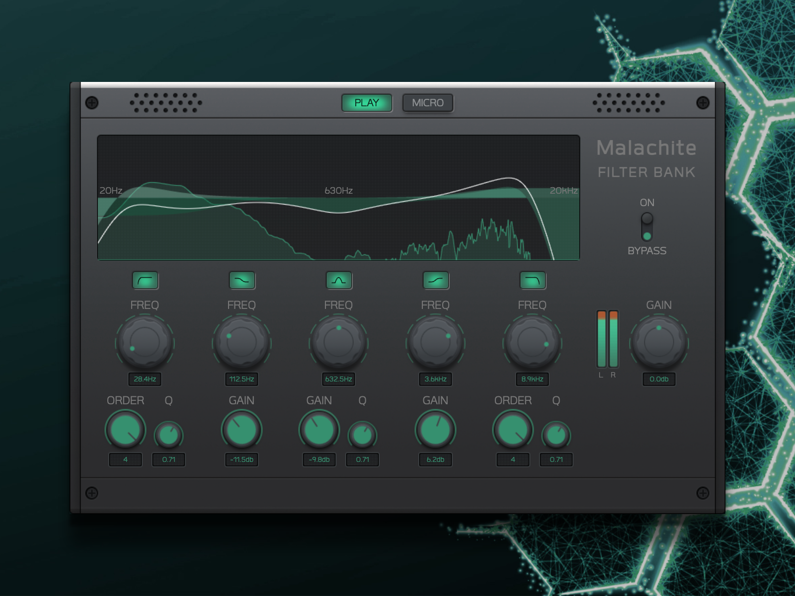

### Malachite

[Interactive Demo of 'Modern Audio' UI-Kit by UI mother](https://uimother.com/collections/gui-kits/products/modern-audio)

> This UI Kit will basically give you a chance to build an awesome product whatever you just want to, from a small Kontakt library to a big VST synthesizer. Soft Malachite PSD UI Kit allows you without questions to use one of our templates, vintage equalizer,
compressor, and synthesizer, tweak it and create a neat and clean VST UI design.

### Credits
Wallpaper Vectors by [Vecteezy](https://www.vecteezy.com/free-vector/wallpaper) | Demo track by [kepz](https://www.audiotool.com/track/0dkqsw3m9ud/) | coded by [andré michelle](https://www.andremichelle.io) | tested on Chrome, Firefox, Safari (Mac) and iPad Pro, iPhone 11 (ios)

### Disclaimer
_**For identification and educational purposes only. Redistribution of the textures is not allowed.**_

[Open in Browser](https://andremichelle.github.io/malachite/)

### Build
Make sure to have sass installed and run in the console:

    sass sass/main.sass:bin/main.css --watch

Make sure to have typescript installed and run in the console:

    tsc -p ./typescript/tsconfig.json --watch
